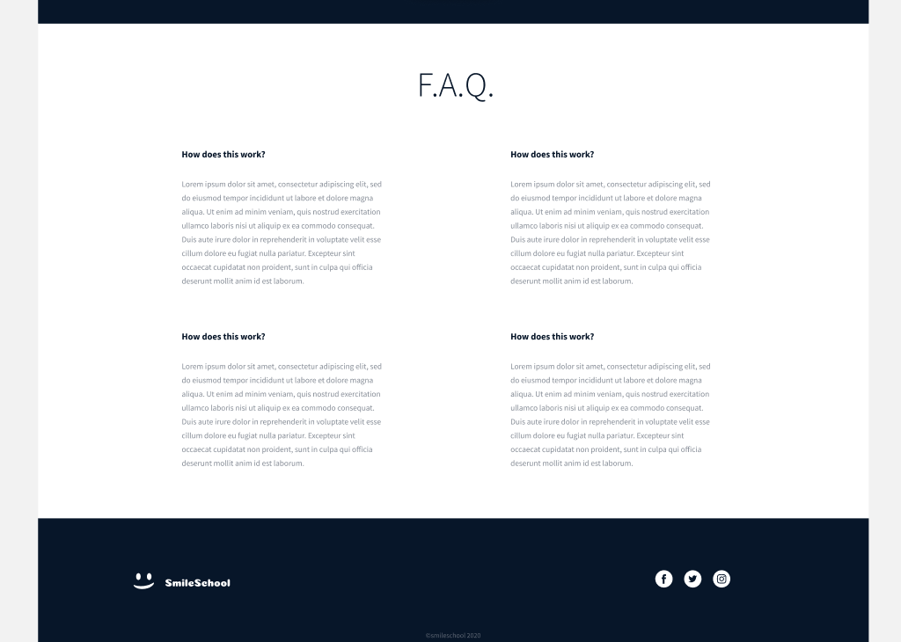

This is for an advanced css project
In this project, you will find the css file to style the index.html file that was previously coded in the html advanced project
our template for the css syle is as below

